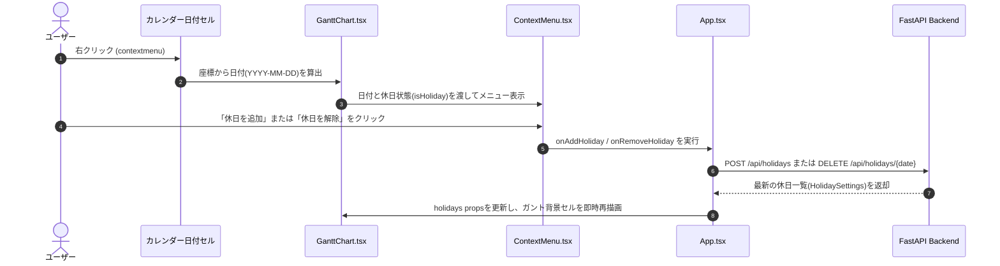

# カレンダー日付右クリックによる休日追加・解除機能 仕様書

## 1. 概要
ガントチャートのカレンダー日付部分（タイムラインヘッダーおよびタイムライン背景）を右クリックすることで、直感的にその日を「休日」として追加、または登録済みの休日を「解除」できる機能です。

## 2. 操作仕様

### 2.1 日付ヘッダー（スケールセル）右クリック時
- カレンダー上部のスケールヘッダー（日・曜日のセル領域）を右クリックした際に発火します。
- クリックされた位置の横スクロール量と座標から、対象日付（`YYYY-MM-DD`）を自動特定します。
- **未登録の日付の場合**：
  - メニューに `🎌 休日を追加 (YYYY-MM-DD)` を表示します。
  - クリックすると即座に `POST /api/holidays` を呼び出し、該当列が休日表示（グレー）に切り替わります。
- **登録済み休日の場合**：
  - メニューに `🗑️ 休日を解除 (YYYY-MM-DD)` を表示します。
  - クリックすると即座に `DELETE /api/holidays/{date}` を呼び出し、該当列の休日表示が解除されます。

### 2.2 タイムライン空き領域（背景セル）右クリック時
- チャート領域のタスクバーがない空きセルを右クリックした際に発火します。
- 従来の「📁 新規プロジェクト追加」「⏰ 新規タスク追加」に加え、クリック列の日付に応じた休日操作メニューが表示されます。
  - 未登録時：`🎌 休日を追加 (YYYY-MM-DD)`
  - 登録済み時：`🗑️ 休日を解除 (YYYY-MM-DD)`

## 3. アーキテクチャと処理フロー



## 4. UI/UX 構成図 (Excalidraw)

```json
{
  "type": "excalidraw",
  "version": 2,
  "source": "https://excalidraw.com",
  "elements": [
    {
      "id": "scale_header",
      "type": "rectangle",
      "x": 100,
      "y": 100,
      "width": 500,
      "height": 40,
      "strokeColor": "#1e1e1e",
      "backgroundColor": "#e0e7ff",
      "fillStyle": "solid",
      "strokeWidth": 1
    },
    {
      "id": "scale_text",
      "type": "text",
      "x": 120,
      "y": 110,
      "width": 460,
      "height": 20,
      "text": "2026年9月 | 14(月) | 15(火) [右クリック] | 16(水) | 17(木)",
      "fontSize": 16,
      "fontFamily": 1
    },
    {
      "id": "menu_box",
      "type": "rectangle",
      "x": 280,
      "y": 150,
      "width": 240,
      "height": 50,
      "strokeColor": "#6366f1",
      "backgroundColor": "#ffffff",
      "fillStyle": "solid",
      "strokeWidth": 2,
      "roundness": { "type": 3 }
    },
    {
      "id": "menu_text",
      "type": "text",
      "x": 295,
      "y": 165,
      "width": 210,
      "height": 20,
      "text": "🎌 休日を追加 (2026-09-15)",
      "fontSize": 14,
      "fontFamily": 1,
      "strokeColor": "#1f2937"
    },
    {
      "id": "arrow_click",
      "type": "arrow",
      "x": 300,
      "y": 125,
      "width": 20,
      "height": 25,
      "strokeColor": "#4f46e5",
      "points": [[0, 0], [20, 25]]
    }
  ],
  "appState": {
    "viewBackgroundColor": "#ffffff",
    "gridSize": null
  },
  "files": {}
}
```

## 5. バックエンド仕様

### `DELETE /api/holidays/{date}`
- **引数**: パスパラメータ `date` (`YYYY-MM-DD` 形式)
- **処理**: `backend/data/holidays.txt` から指定日付を削除し、ソート済みリストを再保存
- **レスポンス**:
  ```json
  {
    "holidays": ["2026-01-01", "2026-01-02"],
    "raw_text": "2026-01-01\n2026-01-02",
    "file_path": "backend/data/holidays.txt"
  }
  ```
