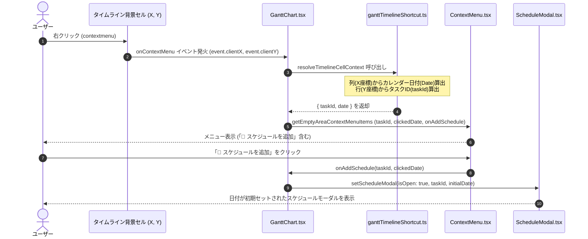

# カレンダー対象部右クリックによるスケジュール追加 & ID番号検索 仕様書

## 1. 概要
本機能改修では、以下の2つのUX向上を実現します。
1. **カレンダー対象部右クリックによる「スケジュール追加」**：ガントチャートのタイムライン領域（タスクバーのない背景セル等）を右クリックした際、クリック位置の列（X座標）からカレンダー日付を、行（Y座標）から該当タスクIDを自動取得し、コンテキストメニューからワンクリックで該当タスク・該当日付にスケジュールを追加できる機能。
2. **タスク検索およびプロジェクト検索のID番号検索対応**：ヘッダーの「タスク検索」「プロジェクト検索」において、タスク名・プロジェクト名だけでなく、ID番号の入力によっても対象要素を素早く検索・絞り込める機能。

---

## 2. 操作仕様

### 2.1 カレンダー対象部（タイムライン）右クリック
- **対象領域**：ガントチャートのタイムライン領域（タスクバーのない背景セル、空き領域）
- **行列からの情報取得**：
  - **列（X軸）**：クリック位置のX座標とタイムラインの横スクロール量から、該当日の日付（`YYYY-MM-DD`）を取得。
  - **行（Y軸）**：クリック位置のY座標とタイムラインの縦スクロール量、行高さから行インデックスを算出し、該当行のタスクID（`taskId`）を取得。
- **メニュー表示**：
  - 行にタスクが存在する場合：
    - `📁 新規プロジェクト追加`
    - `⏰ 新規タスク追加`
    - `📌 スケジュールを追加`
    - `（区切り線）`
    - `🎌 休日を追加 (YYYY-MM-DD)` / `🗑️ 休日を解除 (YYYY-MM-DD)`
  - タスクが存在しない余白行の場合：
    - 従来通り「新規プロジェクト追加」「新規タスク追加」「休日メニュー」のみ表示。
- **スケジュール追加アクション**：
  - 「📌 スケジュールを追加」をクリックすると、取得された `taskId` と `clickedDate` が初期値としてセットされたスケジュール作成モーダル（`ScheduleModal`）が表示される。

### 2.2 タスク検索・プロジェクト検索のID番号検索
- **タスク検索 (`searchText`)**：
  - 入力された検索文字列（スペース区切りの各トークン）が、タスク名（`task.text`）またはタスクのID（`String(task.id)`）に部分一致する場合にマッチ。
  - マッチしたタスクの先祖階層（親プロジェクトなど）もコンテキストとして自動保持・表示。
- **プロジェクト検索 (`searchProject`)**：
  - 入力された検索文字列が、プロジェクト名（`task.text`）またはプロジェクトのID（`String(task.id)`）に部分一致する場合にマッチ。
  - マッチしたプロジェクト配下の子孫タスクも自動的にスコープに含めて表示。

---

## 3. アーキテクチャと処理フロー



---

## 4. UI 構成図 (Excalidraw)

```json
{
  "type": "excalidraw",
  "version": 2,
  "source": "https://excalidraw.com",
  "elements": [
    {
      "id": "header_search",
      "type": "rectangle",
      "x": 60,
      "y": 40,
      "width": 640,
      "height": 45,
      "strokeColor": "#374151",
      "backgroundColor": "#f3f4f6",
      "fillStyle": "solid",
      "strokeWidth": 1,
      "roundness": { "type": 3 }
    },
    {
      "id": "search_task_input",
      "type": "rectangle",
      "x": 80,
      "y": 48,
      "width": 160,
      "height": 28,
      "strokeColor": "#4b5563",
      "backgroundColor": "#ffffff",
      "fillStyle": "solid",
      "strokeWidth": 1
    },
    {
      "id": "search_task_text",
      "type": "text",
      "x": 90,
      "y": 54,
      "width": 140,
      "height": 18,
      "text": "🔍 42 (IDで検索可)",
      "fontSize": 12,
      "fontFamily": 1,
      "strokeColor": "#1f2937"
    },
    {
      "id": "search_proj_input",
      "type": "rectangle",
      "x": 250,
      "y": 48,
      "width": 160,
      "height": 28,
      "strokeColor": "#4b5563",
      "backgroundColor": "#ffffff",
      "fillStyle": "solid",
      "strokeWidth": 1
    },
    {
      "id": "search_proj_text",
      "type": "text",
      "x": 260,
      "y": 54,
      "width": 140,
      "height": 18,
      "text": "📁 3 (Project ID検索)",
      "fontSize": 12,
      "fontFamily": 1,
      "strokeColor": "#1f2937"
    },
    {
      "id": "timeline_grid",
      "type": "rectangle",
      "x": 60,
      "y": 105,
      "width": 640,
      "height": 180,
      "strokeColor": "#9ca3af",
      "backgroundColor": "#ffffff",
      "fillStyle": "solid",
      "strokeWidth": 1
    },
    {
      "id": "task_row_1",
      "type": "rectangle",
      "x": 60,
      "y": 140,
      "width": 640,
      "height": 35,
      "strokeColor": "#e5e7eb",
      "backgroundColor": "#f9fafb",
      "fillStyle": "solid",
      "strokeWidth": 1
    },
    {
      "id": "task_label",
      "type": "text",
      "x": 70,
      "y": 148,
      "width": 160,
      "height": 20,
      "text": "【ID: 42】 設計タスク",
      "fontSize": 13,
      "fontFamily": 1,
      "strokeColor": "#111827"
    },
    {
      "id": "cell_click_target",
      "type": "rectangle",
      "x": 340,
      "y": 140,
      "width": 70,
      "height": 35,
      "strokeColor": "#3b82f6",
      "backgroundColor": "#dbeafe",
      "fillStyle": "cross-hatch",
      "strokeWidth": 2
    },
    {
      "id": "click_pointer",
      "type": "text",
      "x": 345,
      "y": 148,
      "width": 60,
      "height": 18,
      "text": "[右クリック]",
      "fontSize": 10,
      "fontFamily": 1,
      "strokeColor": "#1d4ed8"
    },
    {
      "id": "context_menu",
      "type": "rectangle",
      "x": 425,
      "y": 145,
      "width": 210,
      "height": 125,
      "strokeColor": "#6366f1",
      "backgroundColor": "#ffffff",
      "fillStyle": "solid",
      "strokeWidth": 1.5,
      "roundness": { "type": 3 }
    },
    {
      "id": "menu_item_1",
      "type": "text",
      "x": 440,
      "y": 155,
      "width": 170,
      "height": 18,
      "text": "📁 新規プロジェクト追加",
      "fontSize": 12,
      "fontFamily": 1,
      "strokeColor": "#374151"
    },
    {
      "id": "menu_item_2",
      "type": "text",
      "x": 440,
      "y": 175,
      "width": 170,
      "height": 18,
      "text": "⏰ 新規タスク追加",
      "fontSize": 12,
      "fontFamily": 1,
      "strokeColor": "#374151"
    },
    {
      "id": "menu_item_schedule",
      "type": "text",
      "x": 440,
      "y": 195,
      "width": 170,
      "height": 18,
      "text": "📌 スケジュールを追加",
      "fontSize": 12,
      "fontFamily": 1,
      "strokeColor": "#4f46e5"
    },
    {
      "id": "menu_item_divider",
      "type": "line",
      "x": 435,
      "y": 218,
      "width": 190,
      "height": 0,
      "strokeColor": "#e5e7eb",
      "points": [[0, 0], [190, 0]]
    },
    {
      "id": "menu_item_holiday",
      "type": "text",
      "x": 440,
      "y": 225,
      "width": 170,
      "height": 18,
      "text": "🎌 休日を追加 (2026-04-15)",
      "fontSize": 12,
      "fontFamily": 1,
      "strokeColor": "#374151"
    }
  ],
  "appState": {
    "viewBackgroundColor": "#ffffff",
    "gridSize": null
  },
  "files": {}
}
```
