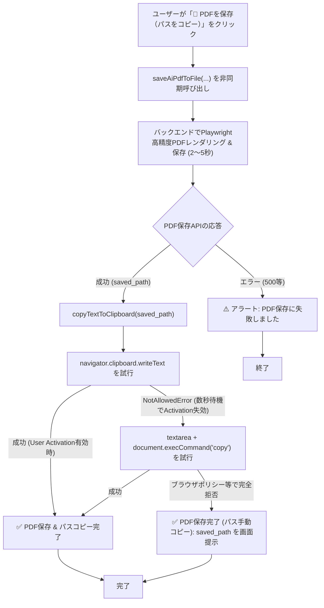

# クリップボード権限エラー防止 & 安全保存フロー

```mermaid
flowchart TD
    Start["ユーザーが「💾 PDFを保存（パスをコピー）」をクリック"] --> CallApi["saveAiPdfToFile(...) を非同期呼び出し"]
    CallApi --> WaitProcess["バックエンドでPlaywright高精度PDFレンダリング & 保存 (2〜5秒)"]
    WaitProcess --> ApiResult{"PDF保存APIの応答"}
    
    ApiResult -- "エラー (500等)" --> ShowSaveError["⚠️ アラート: PDF保存に失敗しました"]
    
    ApiResult -- "成功 (saved_path)" --> StepCopy["copyTextToClipboard(saved_path)"]
    
    StepCopy --> TryModern["navigator.clipboard.writeText を試行"]
    TryModern -- "成功 (User Activation有効時)" --> SuccessCopy["✅ PDF保存 & パスコピー完了"]
    
    TryModern -- "NotAllowedError (数秒待機でActivation失効)" --> FallbackExec["textarea + document.execCommand('copy') を試行"]
    FallbackExec -- "成功" --> SuccessCopy
    
    FallbackExec -- "ブラウザポリシー等で完全拒否" --> ShowManualPath["✅ PDF保存完了 (パス手動コピー): saved_path を画面提示"]
    
    SuccessCopy --> Done["完了"]
    ShowManualPath --> Done
    ShowSaveError --> End["終了"]
```
