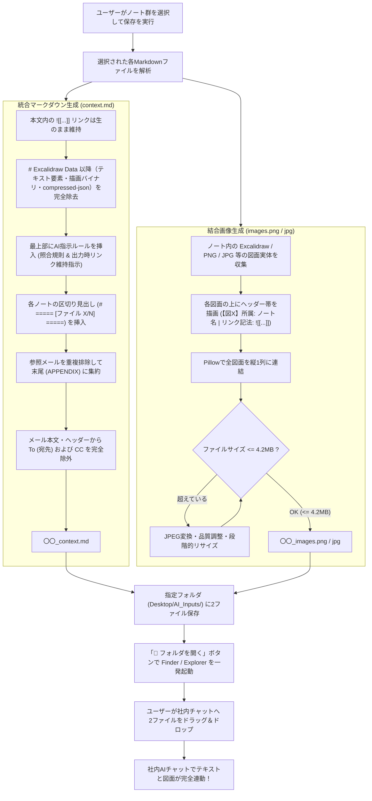

# AIインプット（Markdown & 結合画像）生成・社内チャット連携フロー

```mermaid
flowchart TD
    UserSelect["ユーザーがノート群を選択して保存を実行"] --> ParseNotes["選択された各Markdownファイルを解析"]
    
    subgraph TextProcessing["統合マークダウン生成 (context.md)"]
        KeepRawLinks["本文内の ![[...]] リンクは生のまま維持"]
        StripExcalidraw["# Excalidraw Data 以降（テキスト要素・描画バイナリ・compressed-json）を完全除去"]
        AddRulesHeader["最上部にAI指示ルールを挿入 (照合規則 & 出力時リンク維持指示)"]
        AddDocBorders["各ノートの区切り見出し (# ===== [ファイル X/N] =====) を挿入"]
        ExtractEmails["参照メールを重複排除して末尾 (APPENDIX) に集約"]
        SanitizeEmailHeader["メール本文・ヘッダーから To (宛先) および CC を完全除外"]
        KeepRawLinks --> StripExcalidraw --> AddRulesHeader --> AddDocBorders --> ExtractEmails --> SanitizeEmailHeader --> OutMd["〇〇_context.md"]
    end
    
    subgraph ImageProcessing["結合画像生成 (images.png / jpg)"]
        ExtractImages["ノート内の Excalidraw / PNG / JPG 等の図面実体を収集"]
        DrawHeaderBar["各図面の上にヘッダー帯を描画 (【図X】所属: ノート名 | リンク記法: ![[...]])"]
        VerticalStack["Pillowで全図面を縦1列に連結"]
        CheckSize{"ファイルサイズ <= 4.2MB ?"}
        AutoOptimize["JPEG変換・品質調整・段階的リサイズ"]
        ExtractImages --> DrawHeaderBar --> VerticalStack --> CheckSize
        CheckSize -- "超えている" --> AutoOptimize --> CheckSize
        CheckSize -- "OK (<= 4.2MB)" --> OutImg["〇〇_images.png / jpg"]
    end
    
    ParseNotes --> TextProcessing
    ParseNotes --> ImageProcessing
    
    OutMd --> SaveFiles["指定フォルダ (Desktop/AI_Inputs/) に2ファイル保存"]
    OutImg --> SaveFiles
    
    SaveFiles --> OpenFolderBtn["「📂 フォルダを開く」ボタンで Finder / Explorer を一発起動"]
    OpenFolderBtn --> DragDrop["ユーザーが社内チャットへ 2ファイルをドラッグ＆ドロップ"]
    DragDrop --> AiChat["社内AIチャットでテキストと図面が完全連動！"]
```
