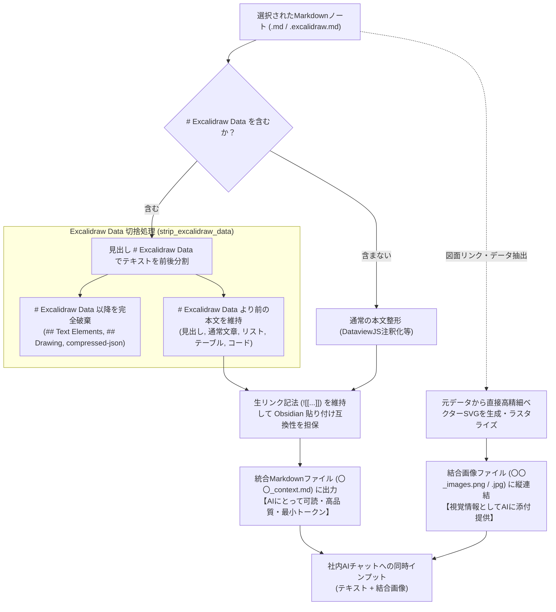

<!--
/**
 * AIインプット用 Markdownエクスポートにおける Excalidraw Data 除去フロー図
 *
 * 1. Markdownノートのパース & 分離
 *    - ユーザーが選択した各ノートから本文とExcalidraw内部データを分離
 * 2. # Excalidraw Data 以降（テキスト要素・描画バイナリ・compressed-json）の完全切捨
 *    - AIにとって解釈不能な文字列・圧縮テキストを排除し、トークン消費を大幅節約
 * 3. 手前の本文・見出し・画像リンク記法（![[...]）の完全保護
 *    - Obsidianコピペ互換性を保証
 * 4. 全図面の高解像度結合画像（.png/.jpg）への集約
 *    - 図面実体は画像側で視覚的にAIへインプット
 **/
-->
# AIインプット Markdownエクスポート Excalidraw Data 完全除去フロー

