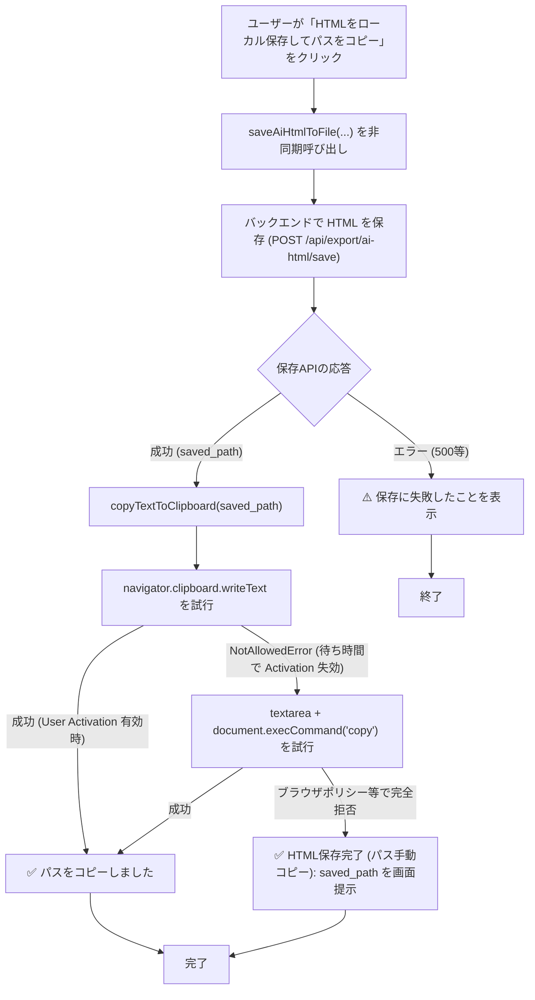

# クリップボード権限エラー防止 & 安全保存フロー

```mermaid
flowchart TD
    Start["ユーザーが「HTMLをローカル保存してパスをコピー」をクリック"] --> CallApi["saveAiHtmlToFile(...) を非同期呼び出し"]
    CallApi --> WaitProcess["バックエンドで HTML を保存 (POST /api/export/ai-html/save)"]
    WaitProcess --> ApiResult{"保存APIの応答"}

    ApiResult -- "エラー (500等)" --> ShowSaveError["⚠️ 保存に失敗したことを表示"]

    ApiResult -- "成功 (saved_path)" --> StepCopy["copyTextToClipboard(saved_path)"]

    StepCopy --> TryModern["navigator.clipboard.writeText を試行"]
    TryModern -- "成功 (User Activation 有効時)" --> SuccessCopy["✅ パスをコピーしました"]

    TryModern -- "NotAllowedError (待ち時間で Activation 失効)" --> FallbackExec["textarea + document.execCommand('copy') を試行"]
    FallbackExec -- "成功" --> SuccessCopy

    FallbackExec -- "ブラウザポリシー等で完全拒否" --> ShowManualPath["✅ HTML保存完了 (パス手動コピー): saved_path を画面提示"]

    SuccessCopy --> Done["完了"]
    ShowManualPath --> Done
    ShowSaveError --> End["終了"]
```
