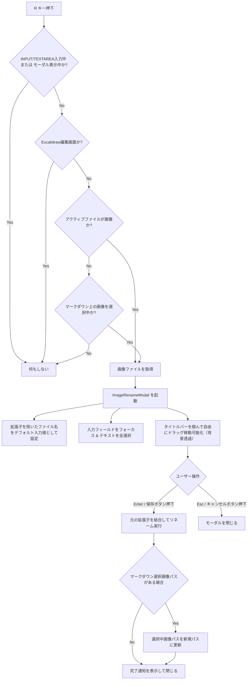

# 仕様書: 画像のショートカットRによるリネーム

## 概要
Obsidianで画像ファイルを開いているとき、あるいはマークダウンプレビューで画像を選択しているときに、キーボードショートカット `R` を押すことで、拡張子を表示せずに現在のファイル名を全選択した状態で画像リネーム用のカスタムダイアログを開き、即座にリネームを行えるようにする。

## トリガー条件
- **対象ファイル**: 画像ファイル（拡張子: `png`, `jpg`, `jpeg`, `gif`, `bmp`, `svg`, `webp`, `tif`, `tiff`）
- **ショートカットキー**: 修飾キー（Ctrl, Cmd, Shift, Alt）なしの単体の `R` または `r` キー押下
- **状態**:
  - 画像ファイルそのものをアクティブビューとして開いている。
  - もしくは、マークダウンプレビューで画像をクリックして選択（`window._selectedMarkdownImageFilePath` に画像パスが保持されている）している。
  - フォーカスがインプット要素（INPUT, TEXTAREA）にないこと（※画像選択中であれば、エディタの contentEditable 内であってもリネーム起動を優先）。
  - すでにモーダルやプロンプト（`.modal, .prompt`）が開いていないこと。
  - **Excalidraw編集中（アクティブファイルが `.excalidraw.md` であるか、アクティブビューのタイプが `excalidraw`）でないこと。**

## 動作フロー

## 技術的要件

1. **イベントリスナーの拡張**:
   - `00_templates/RegisterCustomCommands.md` の `handleMarkdownImageRenameKey` イベントハンドラにおいて、アクティブファイルを `app.workspace.getActiveFile()` から取得し、画像であればそれをリネーム対象とする判定を追加。
   - マークダウン上で画像が選択中（`window._selectedMarkdownImageFilePath` が保持されている状態）であれば、エディタ（`.cm-content`）の `contentEditable` フォーカス時であっても文字入力を防ぎリネームモーダルを起動。
   - アクティブファイル名が `.excalidraw.md` で終わる場合、またはアクティブなビュータイプが `excalidraw` である場合は、リネーム処理を起動せず早期リターン（`return`）する。
    - `e.preventDefault()`, `e.stopPropagation()`, `e.stopImmediatePropagation()` を呼び出し、ショートカットキー自身のイベントを完全消費。
    - **エディタ本文への文字r挿入防止（blur & beforeinput遮断）**:
      - キー押下時に `activeEl.blur()` を即座に実行し、エディタ（CodeMirror 6）の入力受け付けとキャレット選択を解除。
      - `beforeinput` イベントも capture フェーズで完全にブロック（`preventDefault`）し、エディタ本文（画像の左上等）に `r` が打ち込まれるのを物理的に完全防止。
    - **keyup 契機による安全な遅延起動**:
      - `keydown` 中に同期的にモーダルを開くのをやめ、キーストローク完了（`keyup`）イベントを検知して安全にモーダルを開く（最大120msのフォールバックタイマー併用）。
      - これにより、ユーザーがキーを押している最中の打鍵余波（Text Event / IME）がモーダルの `<input>` に流れ込む可能性を物理的に100%遮断する。

2. **画像専用リネームモーダル (`ImageRenameModal`)**:
   - 既存の `RenameModal` クラスを参考に、画像専用の `ImageRenameModal` を構築。タイトルをタブからのリネームと統一（`ファイル名`）。
   - 拡張子抜き（`baseName`）のみを入力テキストボックスの値として設定。
   - レンダリング後およびクリック時に入力フィールドを確実に全選択（`select()` ＆ `setSelectionRange()`）。
   - **ショートカット起動キー余波のブロック ＆ 自動復元セーフティネット**:
     - モーダル表示直後に、起動ショートカットキー（`r`）自身の余波（`keydown`, `beforeinput`, `keypress`）が `<input>` に届いて元のファイル名（例: `IMG_0710`）が置換・消去されてしまわないよう、余波ガードにより余波入力を完全にブロック。他のキーイベントで途中で解除されない持続ガード（600ms）を適用。
     - 打鍵完了後にフォーカス処理を行うよう遅延実行（80ms/180ms）を適用。
     - 万が一起動直後の打鍵余波で値が `r` や空文字に化けた場合も、`input` リスナーで検知して即座に元のファイル名（`this.baseName`）へ自動復元するセーフティネットを装備。
     - これにより、タブから名前変更した際と同様、ショートカットRで開いた際も元のファイル名が表示され、かつ全選択ハイライトされた正しい状態を100%維持。
   - **ファイル名のデフォルト表示維持とそのままの利用**:
     - モーダル起動時に入力欄へ元のファイル名（ベース名、例: `IMG_0710`）を確実にデフォルト値として設定。
     - 勝手に既存の名前を消去（クリア）せず、ユーザーがそのファイル名をそのまま利用して末尾に文字列を追加したり一部を変更したりできるようにする。
     - 矢印キー（`ArrowLeft`, `ArrowRight`等）でカーソル移動した際も元のファイル名を維持。
   - **ドラッグ移動機能 (`setupDraggableModal`)**:
     - モーダルタイトル（`h2`）をドラッグハンドルとし、マウス操作で画面内を自由にドラッグ移動可能にする。
     - モーダル背景（`.modal-bg`）の透過度を調整（`opacity: 0.2`）し、背後の画像を確認しながら名前を入力できるようにする。
   - `renameFile` メソッドにて、`app.fileManager.renameFile(file, newPath)` を呼び出す際、ファイルパスの末尾に元の拡張子を自動的に再結合する。
   - リネーム成功後、`window._selectedMarkdownImageFilePath` がリネーム前のパスであった場合、新しいパスへと更新する。
